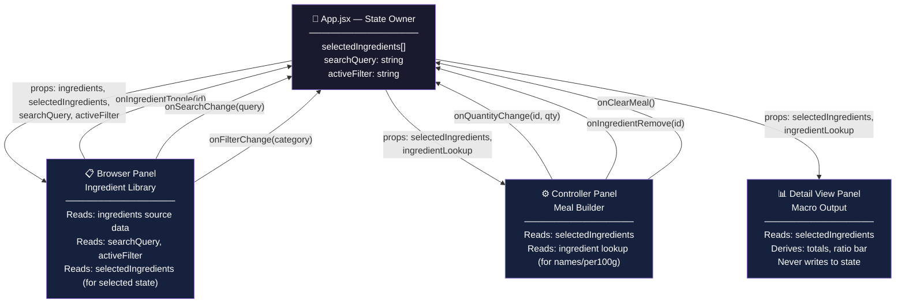

# Reactive Sandbox — Meal Planning + Macro Tracking Platform
**AI 201: Creative Computing with AI — Project 2**
SCAD Atlanta | Spring 2026 | Professor Tim Lindsey

**Live URL:** https://euginahan.github.io/ReactiveSandbox_Claude/

---

## Table of Contents
1. [Design Intent](#design-intent)
2. [Mermaid Diagram](#mermaid-diagram)
3. [AI Direction Log](#ai-direction-log)
4. [Records of Resistance](#records-of-resistance)
5. [Five Questions Reflection](#five-questions-reflection)

---

## Design Intent

### Concept & Vision

#### What it is
A three-panel reactive web application that lets users build meals ingredient by ingredient and see their full macro breakdown update in real time. It is not a calorie counter after the fact — it is a live assembly tool. You pick an ingredient, it lands in your meal, and the numbers adjust immediately.

#### Who it is for
People who care about what they eat and want to understand their food before they cook or eat it — athletes tracking protein intake, people learning to meal prep, or anyone who wants to make intentional food choices without using a clunky mobile app.

#### What makes it different
Most macro trackers are log-after-the-fact tools. This system is compositional — you assemble a meal the way a chef would, seeing the nutritional consequences of each decision as you make it. The interaction should feel like dragging tiles into place, not filling out a form.

---

### Core Interaction Idea

All three panels share a single state object that lives in the root parent component (`App.jsx`). No panel owns its own copy of the data. Every panel receives what it needs as props and communicates changes back up through callback functions.

The flow is:

```
User action in Browser or Controller → callback fires → state updates in App → all three panels re-render with new data
```

- Selecting an ingredient in the **Browser** adds it to the meal in the **Controller** and immediately recalculates totals in the **Detail View**.
- Adjusting a quantity or removing an ingredient in the **Controller** immediately recalculates totals in the **Detail View** and reflects the updated selection state back in the **Browser**.
- The **Detail View** is purely reactive — it never initiates changes. It only reads and displays.

---

### Three Panel Definitions

#### Panel 1 — Browser (Ingredient Library)

**Purpose:** Let the user explore and select from a collection of ingredients. Every meal begins here.

**Key UI Elements:**
- Search bar at the top (filters ingredient list by name in real time)
- Filter tabs: All / Protein / Carbs / Vegetables / Fats / Dairy
- Grid of ingredient cards showing: name, category, calories per 100g, dominant macro
- Visual selected state on cards already in the meal

**Interaction Behavior:**
- Typing in search filters the visible card grid immediately (no submit)
- Clicking a filter tab narrows the grid to that category
- Clicking an unselected card → adds it to the meal at a default 100g
- Clicking a selected card → removes it from the meal (toggle)

**What Triggers Updates:**
- `onIngredientToggle(ingredientId)` — fired on card click
- `onSearchChange(query)` — fired on every keystroke in search
- `onFilterChange(category)` — fired on filter tab click

---

#### Panel 2 — Controller (Meal Builder)

**Purpose:** Show what is currently in the meal and allow direct modification — adjust quantities, remove ingredients, or clear the meal. This panel actively modifies shared state.

**Key UI Elements:**
- List of selected ingredients, each row showing: name, quantity input (grams), calculated macros for that quantity, remove button (×)
- "Clear Meal" button at the bottom
- Empty state message when no ingredients are selected

**Interaction Behavior:**
- Changing a quantity input recalculates that ingredient's macros and updates Detail View totals
- Clicking × removes the ingredient and deselects its card in Browser
- "Clear Meal" empties `selectedIngredients` and resets all totals to zero
- Quantity constrained: minimum 1g, maximum 2000g, integers only

**What Triggers Updates:**
- `onQuantityChange(ingredientId, newQuantity)` — fired on input change
- `onIngredientRemove(ingredientId)` — fired on × click
- `onClearMeal()` — fired on Clear Meal button

---

#### Panel 3 — Detail View (Macro Output)

**Purpose:** Display the complete nutritional picture of the current meal. Read-only. Never initiates changes.

**Key UI Elements:**
- Total macro summary: Calories (large/prominent), Protein (g), Carbohydrates (g), Fat (g)
- Visual macro ratio bar: horizontal bar divided proportionally into protein / carbs / fat (color-coded)
- Per-ingredient breakdown list
- Empty state when meal is empty

**Interaction Behavior:**
- No direct user interaction — purely reactive
- All values update instantly when shared state changes
- Macro ratio bar updates proportionally as ingredients or quantities change

**What Triggers Updates:**
- Any change to `selectedIngredients` in App state causes re-render with recalculated totals

---

### Data Model

#### Ingredient Object (static source data)
```json
{
  "id": "chicken-breast",
  "name": "Chicken Breast",
  "category": "Protein",
  "unit": "g",
  "per100g": {
    "calories": 165,
    "protein": 31.0,
    "carbs": 0.0,
    "fat": 3.6
  },
  "tags": ["lean", "high-protein", "meat"]
}
```

#### Selected Ingredient Entry (in shared state)
```json
{ "ingredientId": "chicken-breast", "quantity": 150 }
```
Macros are **always derived at render time** — never stored. Formula: `(per100g value / 100) * quantity`.

#### Full Shared State Shape
```json
{
  "selectedIngredients": [
    { "ingredientId": "chicken-breast", "quantity": 150 },
    { "ingredientId": "brown-rice", "quantity": 200 }
  ],
  "searchQuery": "",
  "activeFilter": "all"
}
```

#### Derived / Calculated Data (computed on every render, never stored)

| Value | Calculation |
|---|---|
| `totalCalories` | Sum of `(per100g.calories / 100) * quantity` for all selected |
| `totalProtein` | Sum of `(per100g.protein / 100) * quantity` |
| `totalCarbs` | Sum of `(per100g.carbs / 100) * quantity` |
| `totalFat` | Sum of `(per100g.fat / 100) * quantity` |
| `macroRatioBar` | Protein% / Carbs% / Fat% of total calories |

---

### State Flow

#### Where state lives
State lives in `App.jsx` — the root parent of all three panels. Single source of truth.

```
App (state owner)
├── Browser   (reads: ingredients[], searchQuery, activeFilter, selectedIngredients)
├── Controller (reads: selectedIngredients + ingredient lookup)
└── DetailView (reads: selectedIngredients + ingredient lookup → derives totals)
```

#### What happens when a user clicks an ingredient
1. User clicks ingredient card in Browser
2. Browser fires `onIngredientToggle(id)` callback (passed as prop from App)
3. App checks: is `id` already in `selectedIngredients`?
   - **No** → append `{ ingredientId: id, quantity: 100 }` → `setSelectedIngredients([...prev, newEntry])`
   - **Yes** → filter it out → `setSelectedIngredients(prev.filter(i => i.ingredientId !== id))`
4. All three panels re-render with updated state

#### What happens when a user changes a quantity
1. User edits quantity in Controller
2. Controller fires `onQuantityChange(id, newQuantity)`
3. App maps over `selectedIngredients`, updates matching entry's `quantity`
4. Detail View totals recalculate instantly on re-render

---

### Interaction Rules

| Scenario | Behavior |
|---|---|
| Click unselected ingredient | Add to meal at 100g default |
| Click selected ingredient | Remove from meal (toggle) |
| Duplicate add attempt | Blocked — toggle removes instead |
| Quantity field cleared | Treat as 0 during edit; snap to 1 on blur |
| Quantity below 1 | Snap to 1 on blur |
| Quantity above 2000 | Snap to 2000 on blur |
| All ingredients removed | Totals reset to 0, empty states display |
| Search returns no results | Browser shows "No ingredients found" |
| Filter + search combined | Both applied simultaneously (AND logic) |
| Clear Meal | Empties array, resets all totals, deselects all Browser cards |

---

### Visual & UX Direction

**Tone:** Clean, precise, and satisfying. Functional first with small moments of delight. Not clinical.

**Color Palette (intent):**
- Background: off-white or very light warm gray
- Panel borders: subtle, 1px, low contrast
- Accent / interactive: single saturated color for selections and active states (teal, sage, or muted orange — TBD)
- Macro color coding: Protein → blue | Carbohydrates → amber | Fat → coral

**Typography:**
- UI labels and data: sans-serif, medium weight
- Macro totals: large, bold — these are the hero numbers
- Ingredient names: readable, not decorative

**Layout:**
- Three equal-width columns, full viewport width, desktop-first
- Panel headers fixed: "Ingredient Library" / "Meal Builder" / "Macro Output"

**Micro-interactions:**
- Ingredient card click: brief scale-down (0.97) on press, snap back
- Card selected state: border color transition, not a jump
- Controller quantity change: macro numbers update immediately
- Detail View macro bar: width transition on proportion change (~150ms ease)
- Ingredient remove: row fades out — not abrupt
- "Clear Meal": visually distinct destructive style (red-tinted)

**What it should feel like:** Assembling a meal should feel like building something real. Each ingredient click has weight. Numbers respond immediately. The macro bar shifts as you add food. It is a continuous, live composition — not a form.

---

## Mermaid Diagram



---

## AI Direction Log

*3–5 entries documenting what was asked, what AI produced, and what was changed/kept/rejected and why.*

### Entry 1
**Session:** Design Intent & Project Setup
**Asked:** Help write a Design Intent document for a Meal Planning + Macro Tracking Platform with three reactive panels sharing centralized state.
**Produced:** Full Design Intent covering concept, panel definitions, data model, state flow, interaction rules, and visual direction.
**Decision:** Kept the structure and architectural spec. Adjusted the panel descriptions to match my intended interaction model — specifically the toggle behavior for ingredient cards (click to add, click again to remove) and the quantity clamping rules. The data model was adopted as-is since it matches the assignment's "single source of truth" requirement cleanly.

---

*Entries 2–5 to be added as AI coding sessions occur.*

---

## Records of Resistance

*3 documented moments where AI output was rejected or significantly revised.*

---

*To be documented during AI coding sessions. Each entry will answer:*
- *What did AI produce?*
- *Why was it rejected or revised?*
- *What was done instead?*

---

## Five Questions Reflection

*To be completed before final submission.*

**1. Can I defend this?**
*Can I explain every major decision — especially the state architecture?*

**2. Is this mine?**
*Does this reflect my creative direction, or did I mostly follow AI's direction?*

**3. Did I verify?**
*Do the three panels actually share state, or are they faking it?*

**4. Would I teach this?**
*Could I explain the props-down/events-up pattern to a classmate?*

**5. Is my documentation honest?**
*Does my AI Direction Log accurately describe what I asked and what I changed?*

---

*AI 201 Spring 2026 | SCAD Atlanta | Project 2: The Reactive Sandbox*
