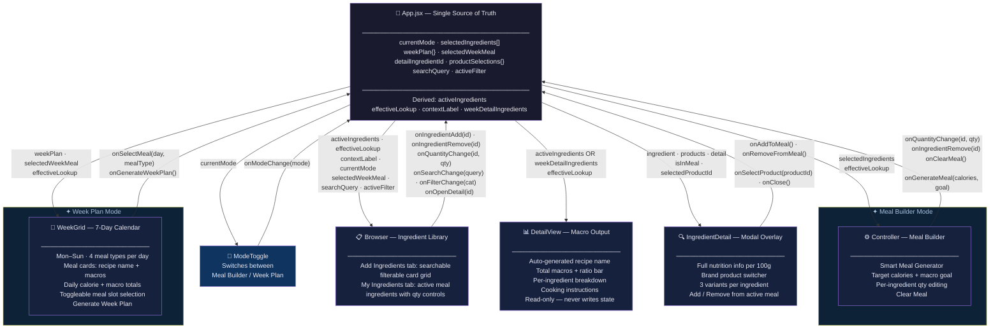

# Reactive Sandbox — Meal Planning + Macro Tracking Platform
**AI 201: Creative Computing with AI — Project 2**
SCAD Atlanta | Spring 2026 | Professor Tim Lindsey

**Live URL:** https://euginahan.github.io/ReactiveSandbox_Claude/

---

## Table of Contents
1. [Design Intent](#design-intent)
2. [Mermaid Diagram](#mermaid-diagram)
3. [AI Direction Log](#ai-direction-log)
4. [Records of Resistance](#records-of-resistance)
5. [Five Questions Reflection](#five-questions-reflection)

---

## Design Intent

### Concept & Vision

#### What it is
A three-panel reactive web application that lets users build meals ingredient by ingredient and see their full macro breakdown update in real time. It is not a calorie counter after the fact — it is a live assembly tool. You pick an ingredient, it lands in your meal, and the numbers adjust immediately.

#### Who it is for
People who care about what they eat and want to understand their food before they cook or eat it — athletes tracking protein intake, people learning to meal prep, or anyone who wants to make intentional food choices without using a clunky mobile app.

#### What makes it different
Most macro trackers are log-after-the-fact tools. This system is compositional — you assemble a meal the way a chef would, seeing the nutritional consequences of each decision as you make it. The interaction should feel like dragging tiles into place, not filling out a form.

---

### Core Interaction Idea

All three panels share a single state object that lives in the root parent component (`App.jsx`). No panel owns its own copy of the data. Every panel receives what it needs as props and communicates changes back up through callback functions.

The flow is:

```
User action in Browser or Controller → callback fires → state updates in App → all three panels re-render with new data
```

- Selecting an ingredient in the **Browser** adds it to the meal in the **Controller** and immediately recalculates totals in the **Detail View**.
- Adjusting a quantity or removing an ingredient in the **Controller** immediately recalculates totals in the **Detail View** and reflects the updated selection state back in the **Browser**.
- The **Detail View** is purely reactive — it never initiates changes. It only reads and displays.

---

### Three Panel Definitions

#### Panel 1 — Browser (Ingredient Library)

**Purpose:** Let the user explore and select from a collection of ingredients. Every meal begins here.

**Key UI Elements:**
- Search bar at the top (filters ingredient list by name in real time)
- Filter tabs: All / Protein / Carbs / Vegetables / Fats / Dairy
- Grid of ingredient cards showing: name, category, calories per 100g, dominant macro
- Visual selected state on cards already in the meal

**Interaction Behavior:**
- Typing in search filters the visible card grid immediately (no submit)
- Clicking a filter tab narrows the grid to that category
- Clicking an unselected card → adds it to the meal at a default 100g
- Clicking a selected card → removes it from the meal (toggle)

**What Triggers Updates:**
- `onIngredientToggle(ingredientId)` — fired on card click
- `onSearchChange(query)` — fired on every keystroke in search
- `onFilterChange(category)` — fired on filter tab click

---

#### Panel 2 — Controller (Meal Builder)

**Purpose:** Show what is currently in the meal and allow direct modification — adjust quantities, remove ingredients, or clear the meal. This panel actively modifies shared state.

**Key UI Elements:**
- List of selected ingredients, each row showing: name, quantity input (grams), calculated macros for that quantity, remove button (×)
- "Clear Meal" button at the bottom
- Empty state message when no ingredients are selected

**Interaction Behavior:**
- Changing a quantity input recalculates that ingredient's macros and updates Detail View totals
- Clicking × removes the ingredient and deselects its card in Browser
- "Clear Meal" empties `selectedIngredients` and resets all totals to zero
- Quantity constrained: minimum 1g, maximum 2000g, integers only

**What Triggers Updates:**
- `onQuantityChange(ingredientId, newQuantity)` — fired on input change
- `onIngredientRemove(ingredientId)` — fired on × click
- `onClearMeal()` — fired on Clear Meal button

---

#### Panel 3 — Detail View (Macro Output)

**Purpose:** Display the complete nutritional picture of the current meal. Read-only. Never initiates changes.

**Key UI Elements:**
- Total macro summary: Calories (large/prominent), Protein (g), Carbohydrates (g), Fat (g)
- Visual macro ratio bar: horizontal bar divided proportionally into protein / carbs / fat (color-coded)
- Per-ingredient breakdown list
- Empty state when meal is empty

**Interaction Behavior:**
- No direct user interaction — purely reactive
- All values update instantly when shared state changes
- Macro ratio bar updates proportionally as ingredients or quantities change

**What Triggers Updates:**
- Any change to `selectedIngredients` in App state causes re-render with recalculated totals

---

### Data Model

#### Ingredient Object (static source data)
```json
{
  "id": "chicken-breast",
  "name": "Chicken Breast",
  "category": "Protein",
  "unit": "g",
  "per100g": {
    "calories": 165,
    "protein": 31.0,
    "carbs": 0.0,
    "fat": 3.6
  },
  "tags": ["lean", "high-protein", "meat"]
}
```

#### Selected Ingredient Entry (in shared state)
```json
{ "ingredientId": "chicken-breast", "quantity": 150 }
```
Macros are **always derived at render time** — never stored. Formula: `(per100g value / 100) * quantity`.

#### Full Shared State Shape
```json
{
  "selectedIngredients": [
    { "ingredientId": "chicken-breast", "quantity": 150 },
    { "ingredientId": "brown-rice", "quantity": 200 }
  ],
  "searchQuery": "",
  "activeFilter": "all"
}
```

#### Derived / Calculated Data (computed on every render, never stored)

| Value | Calculation |
|---|---|
| `totalCalories` | Sum of `(per100g.calories / 100) * quantity` for all selected |
| `totalProtein` | Sum of `(per100g.protein / 100) * quantity` |
| `totalCarbs` | Sum of `(per100g.carbs / 100) * quantity` |
| `totalFat` | Sum of `(per100g.fat / 100) * quantity` |
| `macroRatioBar` | Protein% / Carbs% / Fat% of total calories |

---

### State Flow

#### Where state lives
State lives in `App.jsx` — the root parent of all three panels. Single source of truth.

```
App (state owner)
├── Browser   (reads: ingredients[], searchQuery, activeFilter, selectedIngredients)
├── Controller (reads: selectedIngredients + ingredient lookup)
└── DetailView (reads: selectedIngredients + ingredient lookup → derives totals)
```

#### What happens when a user clicks an ingredient
1. User clicks ingredient card in Browser
2. Browser fires `onIngredientToggle(id)` callback (passed as prop from App)
3. App checks: is `id` already in `selectedIngredients`?
   - **No** → append `{ ingredientId: id, quantity: 100 }` → `setSelectedIngredients([...prev, newEntry])`
   - **Yes** → filter it out → `setSelectedIngredients(prev.filter(i => i.ingredientId !== id))`
4. All three panels re-render with updated state

#### What happens when a user changes a quantity
1. User edits quantity in Controller
2. Controller fires `onQuantityChange(id, newQuantity)`
3. App maps over `selectedIngredients`, updates matching entry's `quantity`
4. Detail View totals recalculate instantly on re-render

---

### Interaction Rules

| Scenario | Behavior |
|---|---|
| Click unselected ingredient | Add to meal at 100g default |
| Click selected ingredient | Remove from meal (toggle) |
| Duplicate add attempt | Blocked — toggle removes instead |
| Quantity field cleared | Treat as 0 during edit; snap to 1 on blur |
| Quantity below 1 | Snap to 1 on blur |
| Quantity above 2000 | Snap to 2000 on blur |
| All ingredients removed | Totals reset to 0, empty states display |
| Search returns no results | Browser shows "No ingredients found" |
| Filter + search combined | Both applied simultaneously (AND logic) |
| Clear Meal | Empties array, resets all totals, deselects all Browser cards |

---

### Visual & UX Direction

**Tone:** Clean, precise, and satisfying. Functional first with small moments of delight. Not clinical.

**Color Palette (intent):**
- Background: off-white or very light warm gray
- Panel borders: subtle, 1px, low contrast
- Accent / interactive: single saturated color for selections and active states (teal, sage, or muted orange — TBD)
- Macro color coding: Protein → blue | Carbohydrates → amber | Fat → coral

**Typography:**
- UI labels and data: sans-serif, medium weight
- Macro totals: large, bold — these are the hero numbers
- Ingredient names: readable, not decorative

**Layout:**
- Three equal-width columns, full viewport width, desktop-first
- Panel headers fixed: "Ingredient Library" / "Meal Builder" / "Macro Output"

**Micro-interactions:**
- Ingredient card click: brief scale-down (0.97) on press, snap back
- Card selected state: border color transition, not a jump
- Controller quantity change: macro numbers update immediately
- Detail View macro bar: width transition on proportion change (~150ms ease)
- Ingredient remove: row fades out — not abrupt
- "Clear Meal": visually distinct destructive style (red-tinted)

**What it should feel like:** Assembling a meal should feel like building something real. Each ingredient click has weight. Numbers respond immediately. The macro bar shifts as you add food. It is a continuous, live composition — not a form.

---

## Mermaid Diagram



---

## AI Direction Log

*5 entries documenting what was asked, what AI produced, and what was changed/kept/rejected and why.*

---

### Entry 1 — UI Aesthetic Overhaul
**Session:** Visual Design & Layout Refinement

**Asked:** The initial build rendered like a functional prototype but felt closer to a word document than an actual product — plain white backgrounds, unstyled panels, default browser inputs, and no visual hierarchy between data and controls. I directed AI to rethink the visual language: make the layout feel like a designed tool, not a scaffold. I asked for a darker, more intentional color palette, proper card styling for ingredients, a panel system with distinct headers, and micro-interactions that gave the interface weight.

**Produced:** AI refactored the entire CSS layer — introducing a consistent design token system (background tiers, border radii, spacing scale), styled ingredient cards with category color-coded badges and icon backgrounds, added hover states and a selection treatment using border highlights, and built out the panel header structure with title/subtitle hierarchy.

**Decision:** Kept the card grid layout and the category badge color system — those immediately made the ingredient library feel like a real product. Pushed back on the font weight choices (AI defaulted too heavy across the board) and asked for the macro numbers in the Detail View to be the clear visual hero of that panel, not competing equally with everything else. Also steered away from a dark-mode-first approach — the palette was adjusted to be light-background with dark accents, which felt more appropriate for a food/wellness tool.

---

### Entry 2 — Ingredient Library Depth + Barcode Simulation
**Session:** Ingredient Data Layer & Browser Panel Expansion

**Asked:** The ingredient cards were showing name and a single calorie number — there was no depth to the library. I directed AI to build out a richer ingredient data layer: full per-100g macros for all ingredients, extended detail information (sourcing notes, nutritional context, tags), and a simulated brand product system where each ingredient has 3 purchasable variants with slightly different macro profiles — mimicking how a real barcode scan would return a specific branded product. I also asked for the Browser panel to be split into two tabs: **Add Ingredients** (the search/filter grid) and **My Ingredients** (a live list of what's in the current meal with inline controls).

**Produced:** AI built out `ingredients.js`, `ingredientDetails.js`, and `products.js` as separate data files — 20 ingredients across 5 categories, each with per100g values, tags, and descriptive detail text. The products file simulated 3 branded options per ingredient with realistic barcode numbers and macro variation. The Browser component was restructured with a segmented tab control, and the My Ingredients tab rendered a live editable list with quantity inputs and remove buttons that wired back into shared state.

**Decision:** Kept the data architecture — separating static ingredient data, product variants, and detail copy into distinct files was the right call and made everything easier to maintain. The barcode numbers are purely cosmetic (no scanner), but they sell the simulation convincingly. One revision: AI initially put quantity controls only in the Controller panel. I insisted they also live in the My Ingredients tab in the Browser, because users shouldn't have to look across the interface to adjust a quantity they just added.

---

### Entry 3 — Recipe Breakdown & Cooking Instructions
**Session:** DetailView Expansion

**Asked:** The Detail View was only showing macro totals and a ratio bar — useful data, but it made the panel feel like a spreadsheet. I asked AI to transform it into something that felt like an actual recipe: auto-generate a recipe name based on the current ingredients, add a per-ingredient cooking instruction section so users understood not just the nutrition but how to prepare each component, and make the recipe name dynamic so it reflected the character of the meal (high protein, balanced, carb-heavy, etc.) based on the ingredient categories present.

**Produced:** AI built a recipe name generator that sorted ingredients by quantity, pulled the top two by weight, and combined them with a character descriptor and format label (Bowl, Plate, Meal) — e.g. "Chicken & Brown Rice Bowl" or "Salmon & Quinoa Plate." It added a `STEP_TEMPLATES` object mapping each ingredient ID to a concise cooking instruction block covering prep, cook method, time, and technique. The Detail View was restructured to show the name, the macro hero numbers, the ratio bar, a per-ingredient breakdown table, and the step-by-step instructions as a unified recipe card.

**Decision:** Kept the name generation logic and cooking steps — they transformed the panel from a data readout into something people would actually want to read. Revised the layout slightly: AI stacked the name above the macro totals, but I moved the macro summary to be more prominent and pushed the recipe name to a secondary position since the numbers are the primary value of the panel. Also trimmed some of the cooking instructions AI wrote — a few were overly detailed for the context.

---

### Entry 4 — Smart Meal Generator
**Session:** Controller Panel — Auto-Generation Feature

**Asked:** I wanted to add a way to generate a complete meal automatically rather than building it manually ingredient by ingredient. I directed AI to build a Smart Meal Generator inside the Controller panel: a user sets an optional target calorie count and picks a macro goal (High Protein, Balanced, or Low Carb), clicks generate, and the system picks a set of ingredients that fits the profile and scales their quantities to hit the calorie target. I asked for a brief loading state so the generation didn't feel instant, and a confirmation prompt if the meal already had ingredients — so users didn't accidentally overwrite something they built manually.

**Produced:** AI built the generator as a card component inside the Controller with a calorie input, a three-option macro goal selector, and a generate button. The generation logic in App.jsx selected ingredients by category rules per goal (e.g. High Protein picks two proteins, one vegetable, one carb), assigned base quantities by category, then scaled the entire set proportionally to hit the target calories using a ratio of target/baseCals. A 700ms setTimeout with a spinner simulated the generation delay. The confirmation state showed inline when the meal wasn't empty, with "Replace" and "Cancel" options.

**Decision:** Kept the generation algorithm and the confirmation flow — both worked well and felt polished. One significant revision: AI's initial calorie scaling had no upper bound on individual ingredient quantities, which could produce absurd values (800g of olive oil). I pushed back and added a per-ingredient cap of 2000g with a minimum of 10g so the output always stayed realistic. Also adjusted the UI layout of the generator card — AI made it too visually prominent, competing with the ingredient list. Reduced it to a collapsible/inset card style so it was accessible but didn't dominate the panel.

---

### Entry 5 — Week Plan View & Fixing the Broken Ingredient Library
**Session:** Week Plan Mode — WeekGrid Component + Bug Resolution

**Asked:** The app was a single-meal tool, and I wanted to extend it into a full week-planning platform. I directed AI to build a second application mode — Week Plan — accessible via a toggle at the top of the app. The center panel would become a 7-day calendar grid showing Monday through Sunday, each column with four meal slots (Breakfast, Lunch, Dinner, Snack). Each slot would display a recipe name and macro summary. A "Generate Week Plan" button would auto-fill all 28 slots using the existing meal template system. The Ingredient Library and Detail View panels needed to stay functional and operate on whichever meal slot was currently selected.

**Produced:** AI built the `WeekGrid` component with day columns, meal type cards showing auto-generated recipe names and macros, daily calorie totals, and a day-level macro footer. The generate function shuffled and cycled through meal templates to fill the week. App.jsx was restructured with `weekPlan`, `selectedWeekMeal`, and mode-aware callback routing so the Browser and DetailView operated contextually on the selected slot.

**Decision:** The calendar grid and template generation worked well and were kept. However, the ingredient library was completely broken in Week Plan mode after the initial build — clicking the "+" buttons had no effect. Through debugging I identified two separate bugs: first, empty meal cards had `disabled` set on them, so users couldn't click into a slot that had no ingredients; second, `weekPlan` was initialized as `null`, meaning the entire grid was hidden behind an empty state until "Generate" was clicked — with no meal cards visible, `selectedWeekMeal` could never be set, which locked the ingredient library permanently. Both were fixed: empty cards were made clickable, and `weekPlan` was initialized as an empty structure so the grid is always visible from the moment you switch modes. I also added toggleable deselection — clicking a selected meal card again returns to the unselected state — because without it you were locked into viewing one meal with no way out.

---

## Records of Resistance

*5 documented moments where AI output was rejected or significantly revised, and what was done instead.*

---

### Resistance 1 — The UI Looked Like a Word Document

**What AI produced:** The first functional build had all three panels working correctly in terms of data — state was lifting, macros were calculating, ingredients were toggling. But visually it looked like an unstyled HTML page. White backgrounds, black default text, browser-native input fields, no spacing system, no hierarchy between panel headers and content. The ingredient cards were essentially list items. Nothing communicated that this was a designed product.

**Why it was rejected:** A functional scaffold is not a finished interface. The assignment asks for a reactive application, not just a working one — and reactivity should feel satisfying to use. An interface that looks like a draft signals that the design intent was never actually executed. The visual layer is where the concept lives for a user.

**What was done instead:** I pushed back and directed a full visual redesign pass — a proper panel system with distinct header sections, an ingredient card grid with category icon backgrounds and color-coded badges, a typography scale that made the macro totals the visual hero of the Detail View, hover states and selection treatments that gave each interaction tactile feedback, and a warm off-white background system that felt intentional rather than default. The UI was rebuilt to match the design intent document, not just satisfy the data requirements.

---

### Resistance 2 — The Ingredient Library Had No Depth

**What AI produced:** The initial Browser panel displayed ingredient name and calorie count — and nothing else. There was no way to learn anything meaningful about an ingredient before adding it. There was no differentiation between browsing (discovering what exists) and managing (editing what's in your meal). Both states were collapsed into a single scrolling list with a "+" button.

**Why it was rejected:** A macro tracking tool where you can't understand what you're tracking is incomplete. Users should be able to make informed decisions — what's in an ingredient, how it compares across brands, why it fits their goal. And mixing "explore" and "manage" in the same view created a usability problem: once you had several ingredients in your meal, there was no clean way to review and edit them without scrolling through the entire library.

**What was done instead:** I directed a full restructuring of the Browser into two distinct tabs — **Add Ingredients** for discovery (searchable, filterable card grid) and **My Ingredients** for management (a live editable list of what's in the current meal with inline quantity controls and remove buttons). I also asked for a simulated brand product switcher inside a detail modal — clicking any ingredient card opens an overlay with full nutritional detail, descriptive context, and three purchasable variants with realistic barcode numbers and slightly different macro profiles per brand. This made the library feel like a real product database rather than a static reference list.

---

### Resistance 3 — Week Plan Mode Was Not Actually Interactable

**What AI produced:** When Week Plan mode was first built, the grid rendered and "Generate Week Plan" populated the calendar with meals. But the ingredient library was completely non-functional in this mode — the "+" buttons did nothing. Spending time in that mode clicking cards produced no visible result and no error. It looked like a display-only view.

**Why it was rejected:** The entire point of Week Plan mode was to extend the Ingredient Library's editing behavior to individual meal slots across a week. A read-only calendar of auto-generated meals isn't interactive — it's a static mockup. The assignment requires reactive state, and this mode had no reactivity at all from the user's perspective.

**What was done instead:** I debugged the issue and found two compounding problems AI had introduced. First, empty meal cards had `disabled` set on them — so any slot without ingredients couldn't be clicked to select it as the editing target, which meant `selectedWeekMeal` could never be set from an empty slot. Second, `weekPlan` was initialized as `null`, which meant the entire grid was hidden behind an empty state screen until "Generate" was clicked — and with no meal cards on screen at all, there was no way to ever set a selection context. I directed both fixes: remove `disabled` from empty meal cards so they're always clickable, and initialize `weekPlan` as an empty structure (all 28 slots present with empty ingredient arrays) so the grid is immediately visible and usable the moment you enter Week Plan mode. I also added toggleable deselection — clicking a selected meal card again should clear the selection — because without it, once you selected a slot you were locked into that context with no way to exit.

---

### Resistance 4 — The Recipe Was Buried Inside the Macro Output

**What AI produced:** When the cooking instructions and recipe name were first added to the Detail View, AI placed them below the macro totals and ratio bar — effectively at the bottom of the panel, requiring a scroll to reach. The panel was structured as: name → macros → ratio bar → per-ingredient breakdown → cooking steps. In practice, the recipe content was invisible unless you already knew to scroll down.

**Why it was rejected:** The recipe content was the most humanizing part of the Detail View — it's what transformed the panel from a spreadsheet into something that actually felt like meal planning. Burying it below five rows of numerical data meant most users would never see it. The panel was treating the recipe as supplementary when it should be treated as central.

**What was done instead:** I pushed back on the layout and directed a restructuring that kept the macro hero numbers prominent (they're the primary output of the system) but gave the recipe name real visual weight as the identity of the meal — above the macro details, not below them. The cooking steps were moved into a clearly labeled section that followed naturally after the per-ingredient breakdown, so the panel read as: what is this meal → what are the numbers → how do you make it. The recipe became the frame for the data, not an afterthought appended to it.

---

### Resistance 5 — It Wasn't Clear When Ingredients Would Appear in Week Plan View

**What AI produced:** When Week Plan mode was first connected to the Ingredient Library, switching modes and adding ingredients produced confusing results. If no meal card was selected, clicking "+" in the library did nothing — but there was no indication why. The panel header just said "Ingredient Library" with no context about what state the system was in. Users had no signal telling them they needed to select a meal slot before the library would respond to their actions.

**Why it was rejected:** Silent failure is a UX failure. A user clicking "+" repeatedly and seeing nothing happen has no way to know whether the feature is broken or whether they're missing a step. The interaction model — select a slot, then add ingredients — is not obvious on first use, and the interface was providing no guidance to bridge that gap.

**What was done instead:** I directed the addition of a context label in the Browser panel header that actively communicates the current editing state. When a meal slot is selected, it reads "Editing: Monday Lunch" — telling the user exactly what they're modifying. When nothing is selected, it reads "No meal selected" — making the required action explicit. A notice banner was also added to the ingredient grid in week plan mode that prompts users to select a meal slot before the "+" buttons become active. These additions made the interaction model self-documenting: the interface itself explains what the user needs to do next.

---

## Five Questions Reflection

**1. Can I defend this?**
I can defend this project and clearly explain the decisions behind it, especially how the shared state powers the three panels in a meal planning and macro tracking system where selecting ingredients, adjusting quantities, and generating meals all update in real time.

**2. Is this mine?**
The concept feels like mine because I started with the idea of making something that helps users not just track macros but actually understand and build meals, and I used AI to help execute that vision rather than define it.

**3. Did I verify?**
I verified that everything is truly connected — when I interact with the ingredient library or weekly planner, it updates the meal builder and macro output through real shared state, not just visual changes.

**4. Would I teach this?**
I understand the system well enough to explain how data flows between components and how interactions trigger updates across the app.

**5. Is my documentation honest?**
My documentation is honest and reflects what I asked AI to do, where I made changes, and how I refined the experience to better match my original idea.

---

*AI 201 Spring 2026 | SCAD Atlanta | Project 2: The Reactive Sandbox*
